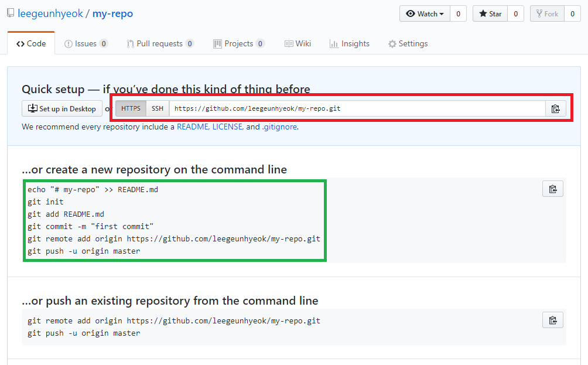

# Github 기초 사용법

## 0) 깃허브 가입
깃허브는 `깃(Git)`을 쉽게 사용할 수 있도록 하는 서비스 중 하나입니다.

다양한 기능 (그룹, Fork 등..)이 있습니다.

가입은 깃허브 홈페이지 [https://github.com](https://github.com) 에서 하실 수 있습니다.

## 1) 깃 설치
- [윈도우](https://gitforwindows.org/)
- [Mac OS](https://git-scm.com/book/ko/v2/%EC%8B%9C%EC%9E%91%ED%95%98%EA%B8%B0-Git-%EC%84%A4%EC%B9%98)
- [Linux](https://git-scm.com/book/ko/v2/%EC%8B%9C%EC%9E%91%ED%95%98%EA%B8%B0-Git-%EC%84%A4%EC%B9%98)

## 2) 깃허브에서 나만의 저장소 만들기
### 1. 깃허브로 접속하여 로그인합니다.
<hr>

### 2. 로그인 후 상단에 `+` 모양을 누른 후 `New Repository`를 선택합니다.

<hr>

### 3. 생성할 저장소 정보를 입력합니다.

<hr>

### 4. 생성 후 깃허브 저장소 주소를 복사합니다. (빨간 네모)

<hr>

### 5. 내 컴퓨터로 돌아와서 저장소를 내려받을 경로로 이동합니다. (예: `D:\project`)

<hr>

### 6. 해당 폴더에서 우클릭을 누른 후 `Git bash here`을 눌러줍니다.
  - 또는 CMD에서 해당 폴더로 이동(`CD 명령어`) 하셔도 됩니다.
  
<hr>

### 7. 아래 명령어를 입력합니다.
  ```bash
  # 원격저장소(Github에서 생성한 저장소)를 로컬(내 컴퓨터)로 복제하는 명령어
  git clone 복사한_저장소_주소

  #예
  git clone http://github.com/user/test.git
  ```
  명령어 입력 시 깃허브에서 생성한 저장소 내용이 그대로 다운로드 됩니다.
  

  - `clone` 후 내려받아진 저장소 폴더
  
<hr>

### 8. 저장소 폴더로 이동합니다.
  ```bash
  cd 저장소_폴더_명
  ```
  
<hr>

### 9. `README.md` 파일을 생성합니다.
  - 팁!: `README.md` 파일은 깃허브 저장소의 공지사항 파일이라고 이해하시면 됩니다.
  - README.md 파일에 해당 저장소가 어떤 저장소인지, 프로그램 설명, 소개, 사용법 등 정보를 작성하시면 됩니다.

  - 명령어로 README.md 생성하기
    ```bash
    # 내용을 README.md 파일로 내보내는 명령어
    echo "# This is my repository!!" >> README.md
    ```

    

  - 메모장 또는 원하는 텍스트 에디터로 `README.md` 파일을 생성하셔도 됩니다.
  - 주의: `README.md.txt` 가 아니라 확장자가 `.md` 인 파일입니다.
<hr>

### 10. 파일 생성 확인 및 Git 상태 확인
  - 파일을 생성하셨으면 정상적으로 저장소 폴더에 추가가 되어있습니다.
  - 아래 명령어를 입력해주세요
    ```bash
    # 현재 깃 상태를 확인하는 명령어
    git status
    ```

    
    
    - 명령어를 입력하면 현재 상태를 출력합니다.
    - `Untracked files` 에 방금 추가한 `README.md` 파일이 추가되어있습니다. 

      

    - 깃의 라이프 사이클은 대표적으로 아래와 같은 상태를 가집니다.
      - `Untracked 추적되지 않음`
      - `Unmodified 변경 되지 않음`
      - `Modified 변경 됨`
      - `Staged 스테이징 됨`

    - 파일을 새로 생성한 경우 `Untracked` 상태
    - 기존에 있던 파일을 수정한 경우 `Modified` 상태
<hr>

### 11. Untracked 상태인 README.md 파일을 스테이징 영역으로 이동하기
  - `스테이징 영역`은 변경사항을 반영(커밋, Commit)하기 전에 임시로 머무르는 공간입니다.
  - `스테이징 영역`은 실제 물리적인 경로가 있는것이 아니기 때문에 눈으로 볼 수 없습니다.
  - 아래 명령어를 입력하여 스테이징 영역으로 이동시킬 수 있습니다.

    ```bash
    # 스테이징 영역에 있지 않던 README.md 파일을 스테이징 영역으로 이동
    git add README.md

    # 변경된 여러 파일을 한꺼번에 보내고 싶을 땐 아래와 같습니다
    git add .
    ```

    

      - 스테이징 영역으로 이동시킨 후 `status` 를 확인
      - `Untracked` 상태였던 `README.md` 파일이 스테이징 영역으로 이동되었습니다.
      - 이제 `README.md` 파일은 반영(커밋)될 준비가 되었습니다!
<hr>

### 12. 스테이징 영역의 파일을 반영하기 (Commit)
  - `스테이징 영역`에 있는 파일들은 반영(커밋)할 수 있습니다.
  - 지금은 REDAME.md 파일 하나만 스테이징 영역에 있지만, 10개, 100개 등 여러 파일이 스테이징 영역에 있다면 모두 `커밋`됩니다.
  - 아래 명령어를 통해 `커밋`할 수 있습니다.

    ```bash
    # 커밋에 메모를 남길 수 있습니다.
    git commit -m "커밋 메시지"
    ```
      

  - 스테이징 영역에 있던 파일들은 모두 `커밋` 됩니다.
  - `git status` 명령어를 입력해보면 아무런 파일이 보이지 않습니다.
  - 커밋을 하면 스테이징에 있던 파일들은 `Unmodified` 상태로 전환 됩니다.
<hr>

### 13. 원격저장소(깃허브)에 업로드하기
  - `12번` 과정까지는 Git의 사용법입니다. (로컬에서 변경사항, 버전관리 등 Git의 기능을 사용할 수 있습니다)
  - 또한 지금까지의 기록을 `깃허브`에 업로드할 수 있습니다.
  - 아래 명령어를 입력하여 쉽게 업로드 할 수 있습니다.

    ```bash
    # origin 이라는 원격저장소의 master 브랜치로 push
    git push origin master
    ```

    

  - `git push` 명령어를 통해 원격저장소(깃허브)로 업로드 할 수 있습니다.
  - 뒤의 origin, master 에 대해서는 추후에 자세히 설명하도록 하겠습니다.
  - 당분간은 업로드 할 때 위와 같은 명령어를 사용하시면 됩니다.
  - 깃의 기본적인 진행 주기는 아래와 같습니다
    ```bash
    # 변경된 파일을 스테이징 영역으로 이동시키고
    git add .

    # 변경된 사항들을 반영하고
    git commit -m "커밋 메시지"

    # 지정한 원격저장소로 업로드합니다.
    git push origin master
    ```

    
    - 깃허브를 확인해보면 커밋 기록과 변경사항이 모두 그대로 업로드 되어있습니다.
<hr>

## 3) 파일 변경 후 업로드하기
> 위에서 진행했던 내용과 동일합니다. 파일 수정 후 동일하게 업로드하시면 됩니다!

### 1. 파일 수정하기
  - Git은 로컬저장소(내 컴퓨터)의 변경사항을 모두 관리하여 알려줍니다.
  - 파일을 `추가/삭제/수정` 과 같은 작업을 한 후 상태를 확인하면 변경사항을 알 수 있습니다.
  - 원래 있던 `README.md` 파일의 내용을 수정하고 저장합니다.

    
<hr>

### 2. 상태 확인하기
  - `git status` 명령어를 입력합니다.

    

    - `추가/삭제/수정`된 파일의 목록이 보입니다.
    - 우리는 파일을 수정하였기 때문에 `README.md` 파일은 `Modified` 상태에 표시됩니다.
<hr>

### 3. 스테이징 영역으로 전환한 후 커밋하기
  - `git add` 명령어로 파일을 스테이징 영역으로 전환합니다.
  - `git add .` 명령어는 모든 변경된 파일을 스테이징 영역으로 전환합니다.
  - 또한 원하는 파일만 스테이징 영역으로 전환하고 커밋할 수 있습니다.

    ```bash
    git add .
    git commit -m "커밋 메시지"
    ```

    
<hr>

### 4. 원격저장소(깃허브)에 업로드하기
  ```bash
  git push origin master
  ```

  

  - 깃허브에 가서 커밋 기록을 확인 할 수 있습니다.
<hr>

### 5. 깃허브에서 커밋 기록 확인하기
  - 커밋 기록을 모두 확인 할 수 있습니다.
  - 변경사항이 궁금한 커밋을 눌러 파일의 변경사항을 확인할 수 있습니다.
  
  
<hr>

## 4) 정보
  - 작성자: [Leegeunhyeok(이근혁)](https://github.com/leegeunhyeok)
  - 깃 초보자를 위한 자료입니다.
  - 비영리 목적으로 자유롭게 사용 가능합니다.
  - 최종 수정일 : `2018-07-12`